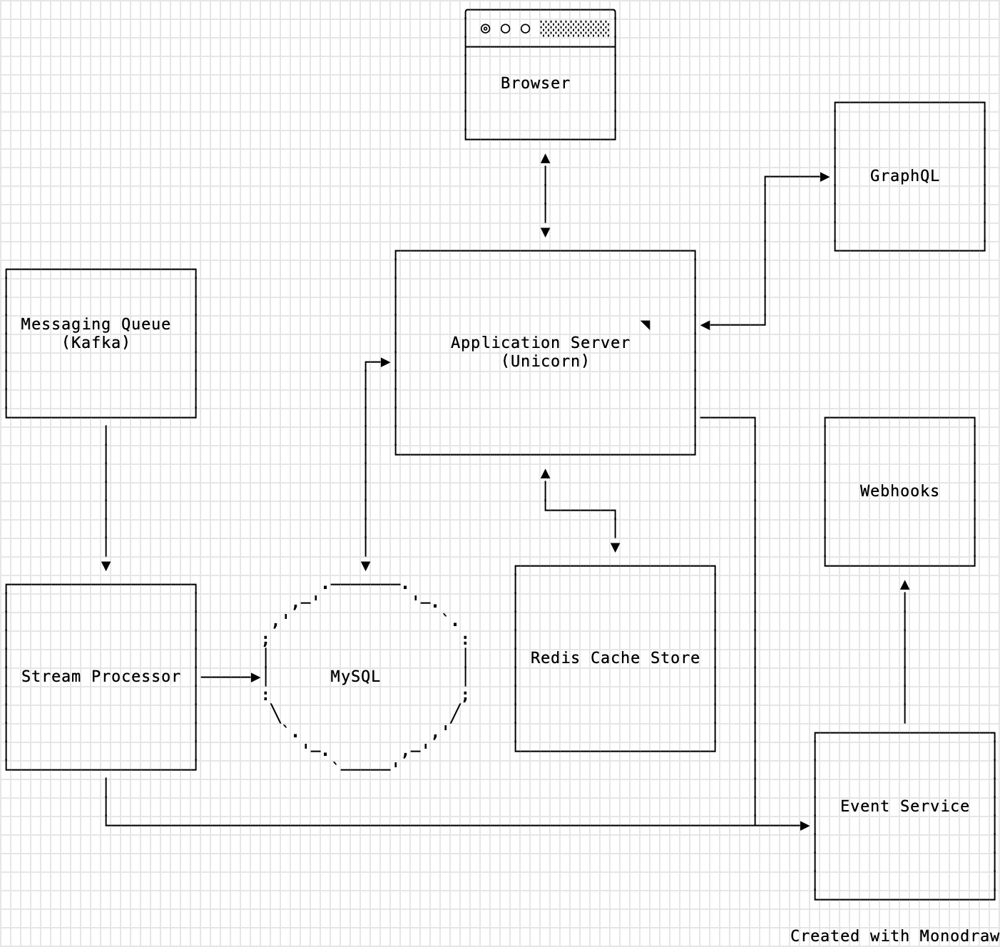
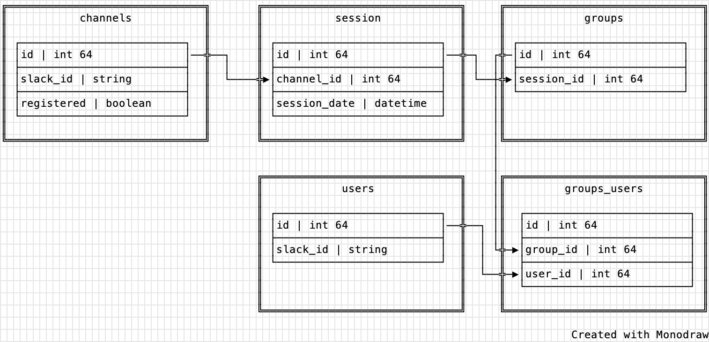
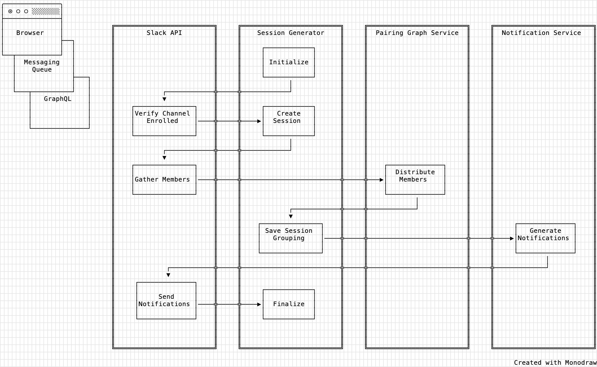

# Forum Application Architecture

This document describes the overall architecture of the Forum Application.

## Highlevel Component Digram

Our system consists primarily of a Unicorn based application server running our Rails application, backed by a MySQL 8.1 database (single cluster). A Redis cluster provides a caching layer and rate limit store. Our service recieves messages from other network services over the kafka MQ - these are handled via a separate stream processor which updates the database as necessary. Separately, we offer customers the option of registering webhooks for certain events or querying the platform via Graph QL.

## Relationship Diagram

Sessions are created by grouping users together for a given channel.

## Flow Diagram

To generate a grouping, the session generator is initiated. It asks Slack to verify the channel is enrolled. If it is, the generator creates the session and then makes another request to Slack to supply the list of users who are members of the channel. This list is then handed off to the Graph Service to group users based on preferences and grouping history. The final grouping is then handed back to the generator to save to the database. It then uses the notification service to generate and enqueue notification messages which are dispatched asynchronously to the Slack API to deliver.
